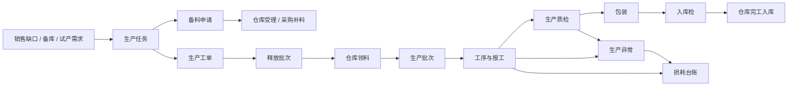

# 生产模块整体设计建议

> 日期：2026-07-18  
> 状态：整体信息架构与业务边界分析，尚未作为已实施功能验收。  
> 依据：`erp-web-prototype-blueprint.md`、`erp-web-business-fact-model.md` 和已验证的销售—生产—质检—仓库运行时事实。

## 1. 总体结论

当前生产模块已经具备任务、备料、工单、释放、现场批次、质检衔接、损耗、配方、工艺和异常等主要对象，问题不是缺菜单，而是十个入口全部平铺，并且工作台同时展示计划、班次、现场和外部待办，层级不够清晰。

推荐把生产模块组织成：

1. 一条生产主链；
2. 一个高频工作台；
3. 三类辅助能力：记录分析、生产设置、跨模块协同。

不建议继续新增“领料、质检、完工入库、报工记录”等一级菜单。领料和入库归仓库，质检归质检，报工归生产批次和工作台。

## 2. 生产主链



备料申请和生产工单允许并行推进：缺料不阻止建立计划工单，但必须限制实际释放、领料和开工。

## 3. 推荐菜单结构

```text
生产
├─ 生产工作台
├─ 计划与准备
│  ├─ 生产任务
│  ├─ 备料申请
│  └─ 生产工单
├─ 执行与追踪
│  ├─ 生产批次
│  └─ 生产异常
├─ 记录与分析
│  └─ 损耗台账
└─ 生产设置（按权限显示）
   ├─ 生产配方
   ├─ 生产工艺
   └─ 系统动作（仅管理员）
```

如果左侧导航暂时不支持多级分组，可以使用不可点击的小标题或分隔线表达四个分组，不继续把十个菜单视觉上摆成同一层级。

### 3.1 现有菜单处理建议

| 当前菜单 | 建议 | 处理方式 |
| --- | --- | --- |
| 生产工作台 | 生产工作台 | 保留为默认入口 |
| 生产任务 | 生产任务 | 保留，归入计划与准备 |
| 备料申请 | 备料申请 | 保留，归入计划与准备 |
| 生产工单 | 生产工单 | 保留，归入计划与准备 |
| 流转批次 | 生产批次 | 改成业务人员更容易理解的名称，归入执行与追踪 |
| 异常闭环 | 生产异常 | 名称简化，闭环是页面职责而不是菜单名称 |
| 损耗台账 | 损耗台账 | 保留，归入记录与分析 |
| 物料配方 | 生产配方 | 归入生产设置 |
| 工艺模板 | 生产工艺 | 归入生产设置，页面内部仍按版本管理 |
| 工序节点 | 系统动作 | 普通用户隐藏，仅管理员可查看；也可只允许从工艺详情下钻 |

不单独设置“释放批次”菜单。释放是工单进入现场的授权合同，主要在生产工单详情和工作台“释放与排产”中处理；其历史记录可从工单或生产批次下钻。

## 4. 各业务对象职责

### 4.1 生产任务

生产任务是需求包，不是单一成品建议。它应支持一个来源单据的多个成品行，并按来源行保存：

- 来源单据、来源行；
- 需求数量、库存承接数量、需生产数量；
- 已建工单、已释放、已入库和待建工单数量；
- 交期、优先级、负责人；
- 物料预估与备料风险。

当前类型仍以单个 `productCode/sourceLineId` 为主，但页面已经出现“成品明细”结构。后续应把底层改为真实任务明细，才能支持任务拆分、工单合并和多成品销售订单。

### 4.2 备料申请

备料申请只表达生产对仓库的物料需求：

- 生产提出申请数量和需求日期；
- 仓库决定库存满足、调拨满足或不足；
- 不足数量转采购申请；
- 来料经过质检和仓库入库后，才重新计算可释放数量。

生产人员不能在此页面替采购选择供应商，也不能把采购到货直接标记为可用。

列表应聚焦来源、需求日期、申请数量、仓库承接、转采购数量和下一步；长备注回详情页。

### 4.3 生产工单

一张工单只生产一种成品，但可承接一个或多个生产任务明细，并支持一个任务明细拆成多张工单。工单负责：

- 计划数量、计划日期、交期和负责人；
- 配方版本与工艺版本；
- 适用产线或设备范围；
- 不可变配方/工艺快照；
- 释放、报工、合格、入库数量汇总。

工单保存不等于释放。缺料时仍可保存和确认计划工单，但释放数量受物料、产线、质量和权限门禁控制。

### 4.4 释放批次

释放批次表达“本次允许多少数量进入现场”，保存：

- 来源工单和来源任务行；
- 本次释放数量；
- 产线、班次和负责人；
- 物料校验结果；
- 释放、领料、现场、质量和入库五类独立状态。

它不是生产批次的别名，也不应因为创建排产记录就提前计入已释放。

### 4.5 生产批次（当前流转批次）

生产批次是现场执行和追溯载体，负责：

- 来源工单、释放批次、配方/工艺快照；
- 工序实例和动作实例；
- 开工、暂停、恢复、报工和包装；
- 原料批次到大盘、再到小盘的批次谱系；
- 报工、合格、不良、放行和入库数量。

生产批次详情只执行生产角色当前能做的动作。等待质检或仓库时显示阻断原因与下钻入口，不让生产角色代替质检放行或仓库过账。

### 4.6 生产异常

异常可由生产人工上报，也可由缺料、设备、报工差异和质检不合格自动触发。建议保存：

- 来源对象和来源行/批次；
- 异常类型、严重程度和阻断对象；
- 影响数量与正确基础单位；
- 临时遏制、原因分析、纠正措施；
- 责任部门/责任人、验证人、关闭时间；
- 是否仍阻断生产、质量或入库。

质检不合格的检验结论和处置归质检；生产异常只承接返工、调机、隔离执行等生产侧整改，不覆盖原质检结论。

### 4.7 损耗台账

损耗台账是只读记录与分析入口，主要由报工、换色清机、返工、异常和质检处置自动产生。它区分：

- 标准工艺损耗；
- 异常损耗；
- 报废、返工、余料或可回收数量；
- 工单、批次、工序、产线、班组和责任对象。

普通用户不直接覆盖来源记录；确需更正时使用有原因和审计的更正动作。

## 5. 生产工作台设计

当前“任务与建单、释放与排产、现场执行、异常”四个页签的方向正确，建议保留，但每个页签必须只服务一种工作场景。

### 5.1 任务与建单

- 面向计划员；
- 只看待承接需求、交期风险、成品库存承接、物料缺口和待建工单；
- 分栏展示任务列表和紧凑判断摘要；
- 完整物料表、全部关联工单和历史记录回任务详情；
- 主动作是建工单或发起备料申请。

### 5.2 释放与排产

- 面向计划员/生产主管；
- 左侧显示待释放工单及可释放数量；
- 右侧显示产线负荷、当前批次和队列；
- 主动作分开为“确认释放”和“加入队列”，不能用排队代替释放；
- 不把待包装批次混入待释放工单列表。

### 5.3 现场执行

- 面向班组长和操作人员；
- 班次、人员、交班信息只在本页签重点展示，不重复压在计划页签顶部；
- 每条产线只突出当前批次、当前工序、剩余数量、阻断原因和一个主动作；
- 高频动作：确认领料、开机、暂停/恢复、报工、包装、异常上报、交班；
- 等待质检/仓库时只显示“查看质检任务/查看入库单”。

### 5.4 异常协同

- 只显示仍阻断生产或需要生产侧处理的异常；
- 缺料进入备料/采购跟进；设备和工艺异常进入生产整改；质量处置进入质检下钻；
- 已有正式异常单时进入原单续办，不重复创建；
- “释放批次关注”和“异常单”使用同一阻断事实，避免重复统计。

### 5.5 工作台共性规则

- 顶部指标按当前页签变化，不在四个页签重复同一组数字；
- 同一名称的指标在任何页签必须使用同一统计口径；
- 工作台只显示当前待办，不复制完整列表和详情；
- 所有动作读取结构化事实，不能依靠“下一步”中文文案决定按钮；
- 计划页签不展示整块班次交接信息，现场页签不展示完整任务物料评估表。

## 6. 状态拆分

生产模块不再用一个主状态覆盖全部含义：

| 维度 | 示例 |
| --- | --- |
| 单据生命周期 | 草稿、已确认、已关闭、已作废 |
| 任务承接 | 待建工单、部分建单、已承接 |
| 物料准备 | 未校验、齐套、部分齐套、缺料、待检 |
| 释放进度 | 未释放、部分释放、已释放、已撤回 |
| 现场执行 | 未开工、执行中、已暂停、已报工、已完成 |
| 质量进度 | 未触发、待检、检验中、待处置、已放行、已拒收 |
| 入库进度 | 未报工、待放行、待入库、部分入库、已入库 |
| 异常状态 | 无异常、处理中、已解除、仍阻断 |

页面可以计算“当前环节”和“下一步”，但它们只是展示结果，不允许人工直接维护。

## 7. 跨模块边界

| 动作 | 所属模块 | 生产模块中的表现 |
| --- | --- | --- |
| 库存校验/预留/分配 | 仓库 | 读取可用、分配、待检和缺口 |
| 生产领料/退料过账 | 仓库 | 发起需求、查看进度和来源批次 |
| 来料/生产/入库质检 | 质检 | 查看任务、阻断和放行数量 |
| 完工入库过账 | 仓库 | 发起/查看入库单，读取累计入库 |
| 采购补料 | 采购 | 查看采购申请、到货和可用时间 |
| 返工执行 | 生产 | 承接质检处置数量并生成返工/复检链 |

生产工作台可以汇总跨模块结果，但不能直接修改仓库库存、质检结论或采购履约状态。

## 8. 当前实现中需要优先修正的问题

1. 生产任务底层仍偏单成品，尚未真正形成多明细需求包；
2. 代表任务 `PT2-260701-003` 在不同页面出现“已建工单 0”与关联工单并存，任务—工单承接事实不一致；
3. 同一物料在任务与备料申请页面出现不同可用库存，说明仍有静态数据和运行时库存口径混用；
4. 异常影响数量出现“1件”，但对应成品基础单位是“卷”；
5. 工作台计划页签也长期展示班次交接块，导致计划判断和现场信息混在一起；
6. “待释放工单 / 待包装批次”放在同一选择区，混合计划对象和执行对象；
7. 当前流转批次菜单说明写成“报工后承接”，但运行事实中生产批次应从释放/领料后开始承接现场执行；
8. 质量异常详情顶部显示通用“处置”，但正式质量处置归质检，生产页应显示明确的生产整改或质检下钻动作；
9. 生产规则页仍使用统一“复核/定期复核”占位动作，缺少真实版本发布和复核事实；
10. 旧生产原型视图文件仍保留在项目中，待新结构稳定后应清理或明确归档，避免后续维护误改两套实现。

## 9. 建议实施顺序

### 第一阶段：事实与边界

1. 任务改为真实多明细；
2. 支持任务拆分到多工单、多个任务行合并到一张同成品工单；
3. 统一任务、备料、工单、库存和质量的运行时来源；
4. 修正单位、承接数量与异常阻断。

### 第二阶段：菜单与页面

1. 按“计划与准备、执行与追踪、记录与分析、生产设置”分组菜单；
2. 流转批次改名为生产批次，工序节点下沉为系统动作；
3. 收敛工作台四个页签的信息密度和角色边界；
4. 按对象职责重排列表、详情和新建页。

### 第三阶段：配方与工艺

按 `erp-web-production-rule-design.md` 完成配方净用量、工艺损耗、适用范围、参数组、发布版本和工单快照。

### 第四阶段：现场闭环

1. 工序实例与动作实例；
2. 返工任务、返工执行、复检任务和复检结论；
3. 超产、尾差关闭、暂停恢复、撤销和反向冲销；
4. 工作台按角色和权限形成真实高频操作入口。

不建议现在增加复杂甘特图、APS、设备维护或更多一级菜单。先把上述主链做实，再根据真实排产规模决定是否需要独立的产能排程页面。

## 10. 2026-07-19 整体复核结果

- 菜单、列表和详情已统一使用“生产批次 / 生产工艺 / 系统动作 / 生产异常”，旧原型视图与 `productionFlow` 静态流程数据已删除。
- 工单单位已收口为成品基础单位；批次列表消除了阶段与节点重复；任务物料表保留数量维度但减少重复标签。
- 工作台不再直接解除异常。异常停机下钻原异常单，暂停和恢复通过原因抽屉提交；包装确认通过独立对话框提交箱号或托盘号。
- 系统动作明确为只读能力库，详情不再复制交易单据的打印、日志和维护轨迹；工艺与配方仍按版本规则维护。
- 当前仍需后续继续建设的重点不是增加页面，而是任务多明细持久化、跨任务同成品合并工单、正式返工执行链、尾差关闭与反向冲销，以及数据库事务、幂等和并发约束。
