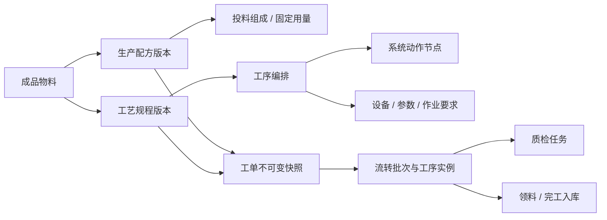

# 生产配方、工序与工艺设计建议

> 日期：2026-07-18  
> 状态：配方部分已实施，工艺与系统动作部分继续作为后续设计分析。  
> 优先级：服从 `erp-web-prototype-blueprint.md` 与 `erp-web-business-fact-model.md`；旧优化清单只作为历史参考。

## 1. 设计结论

三个对象应按“做什么产品、经过什么流程、系统在节点上做什么”分层：

| 对象 | 回答的问题 | 用户维护内容 | 不应承担的内容 |
| --- | --- | --- | --- |
| 生产配方 | 做出该产品需要什么、各用多少 | 每单位净重、投料组成、固定用量、预估损耗规则、版本与适用成品 | 温区、设备、实际损耗、质检流转、仓库动作 |
| 工艺规程（当前工艺模板） | 该产品如何生产 | 适用范围、工序顺序、设备、参数、作业要求、控制点 | 实际报工、实际质检结果、实际入库状态 |
| 系统动作节点（当前工序节点） | 进入某节点后系统生成什么任务、由谁完成、完成后如何推进 | 原则上由系统维护，业务人员只读 | 具体产品温度、现场作业说明、实际执行记录 |

当前已确认三个边界结论：

1. 每单位净重和预估损耗保留为配方内结构化计划规则；实际损耗独立进入损耗台账；
2. 工艺模板缺少可维护的适用产品/产品族、产线或设备范围，却固定展示一套温区；
3. 工序节点同时包含生产、仓库、质检和入库动作，继续称为普通“工序”会让用户误解其职责。

## 2. 推荐关系

工单确认或释放时必须冻结配方与工艺规程快照。后续新版本发布不能改变历史工单。

## 3. 生产配方

### 3.1 推荐保留

- 适用成品；
- 系统生成的版本号；
- 每单位净重：在配方中结构化必填，不从物料规格文本猜测；
- 投料组成：树脂、色母、助剂等按质量占比维护；
- 固定用量：按每单位成品固定耗用数量维护，不限定为包材；
- 变更说明、附件、启用状态和版本历史。

### 3.2 推荐调整

- “每单位净重 kg”由配方维护人员规范填写并校验大于 0，避免依赖不一定存在且难以结构化提取的物料规格文本。
- 页面拆为“投料组成”和“固定用量”两个小节，底层继续共用统一明细结构；物料不能跨区重复。
- 投料占比展示合计并提示偏差，但不把合计 100% 作为保存或启用的机械阻断条件。
- 原料、半成品和包装物料按物料基础单位计算，不新增销售/采购单位换算。

### 3.3 预估损耗规则

为了让生产任务生成时无需等待工艺、设备或排产信息即可计算预计需求，配方保留按物料维护的计划损耗规则：

- 任务固定损耗：每张生产任务预计固定追加的物料数量；
- 比例损耗：按该物料净用量增加的百分比；
- 预计需求 = 配方净用量 + 固定损耗 + 比例损耗。

这些数值只用于计划预估。生产执行后的实际损耗仍进入损耗台账，不回写覆盖配方；任务拆批后如需提高精度，可在工单阶段根据实际批次数重新估算。

### 3.4 版本规则

- 状态使用“草稿、启用、停用”，页面不提供状态下拉选择；
- 新建和普通保存只保存草稿，显式执行“启用版本”后才允许任务和工单选用；
- 已启用或已停用版本不可直接修改，变更时创建下一版本草稿；
- 同一公司、同一成品在同一适用范围内只能有一个当前发布版本；
- 替代料或临时偏离通过工单偏离/审批记录处理，不覆盖原配方。

## 4. 工艺规程（当前工艺模板）

### 4.1 头部必须先确定适用范围

- 适用产品族或具体成品；
- 适用产线类型、设备类型，必要时限定具体设备；
- 工艺版本、状态、生效日期和变更说明；
- 标准生产批量或适用批量区间，用于固定损耗和节拍判断。

当前数据已有 `productFamily` 和 `lineTypes`，但新建/详情页面未完整呈现，应补齐并改成结构化选择，而不是自由文本。

### 4.2 参数应跟随工序，不使用固定温区墙

当前新建页默认铺出水槽和 13 个温区，不适用于所有工艺；“按工艺卡”也不能作为本工艺卡里的有效公差。建议按工序维护参数组：

- 烘干：温度、时间、露点或含水要求；
- 挤出：各温区目标值、上下限，螺杆转速、熔体压力；
- 冷却/牵引：水槽温度、线速、牵引比；
- 收卷/复绕：张力、速度、目标净重；
- 包装：标签版本、装箱规则。

参数保存为结构化数值：`parameterId + target + min/max + unit`，不保存带 `℃`、`rpm` 的计算字符串。选择产线/设备类型后可套用参数预设，再允许本版本调整。

### 4.3 工序卡推荐内容

每道工序只展示当前角色真正需要的信息：

1. 工序名称与执行角色；
2. 适用设备；
3. 关键参数；
4. 作业要点；
5. 质量控制点/引用标准；
6. 完成条件和异常去向。

“系统动作摘要”可以保留为次要信息，不应比作业内容更抢眼。质检节点只引用质检标准版本，不在工艺模板里复制整套检验项目。

### 4.4 版本和发布

与配方使用同一套草稿、启用、停用、新建版本规则。工单只能选择已启用且适用成品、产线匹配的版本；历史工单读取自己的快照。

## 5. 系统动作节点（当前工序节点）

### 5.1 名称和职责

当前节点包括仓库发料、生产确认、开机检、报工、包装和完工入库，它们不全是制造工序。建议用户可见名称改为“系统动作节点”或“流程动作”，避免与工艺规程中的实际工序混淆。

### 5.2 菜单位置

- 普通生产人员不需要顶级菜单入口；
- 放入“生产设置”分组，仅管理员/工艺管理员可查看；
- 业务人员从工艺规程中的工序卡下钻查看即可；
- 系统预设节点不显示新建、编辑、停用、附件和“必填星号”等维护暗示。

### 5.3 两层运行模型

- 节点定义：说明动作类型、执行方、触发条件、是否阻断、完成事件和异常事件；
- 动作实例：生产运行中按工艺快照生成，记录待办、执行人、开始/完成时间、结果、幂等键和日志。

页面上看到的“已完成/待处理”必须来自动作实例，不能回写修改节点定义。

## 6. 页面调整优先级

### P0：先修业务边界

1. 补齐工艺规程适用范围；
2. 明确配方净用量与工艺损耗边界；
3. 配方和工艺统一草稿/启用/停用版本模型；
4. 工单只能引用已启用且适用范围匹配的版本，并保存不可变快照。

### P1：再重排页面

1. 配方拆成“配方基础、投料组成、固定用量、预估损耗规则”；
2. 工艺规程拆成“适用范围、工序路线、工序参数、版本记录”；
3. 温区改为工序内动态参数，不再给所有模板预填同一套 14 项温区；
4. 列表优先显示适用成品/产品族、版本、适用产线和发布状态，温区数量与更新人降为次要信息。

### P2：最后接运行状态机

1. 由工艺快照生成工序实例和动作实例；
2. 接入领料、报工、质检、包装、入库和异常；
3. 增加撤销、重试、返工回跳、复检和审计规则。

## 7. 当前页面的具体问题记录

- 物料配方详情的基础区与右侧摘要重复显示版本、成品和启用状态，右侧只应保留版本关系、引用情况和主要动作；
- 配方列表“创建人/更新”优先级高于适用范围和发布状态，不利于找规则；
- 工艺模板列表未展示数据中已有的产品族和产线类型；
- 工艺模板新建页默认载入固定 14 项温区和一条工序，容易把旧模板误当新模板；
- 温区值存在纯数字与带 `℃` 字符串混用，公差“按工艺卡”无法参与校验；
- 系统预设工序详情仍显示必填星号、维护状态、停用阶段和附件，和只读系统能力的定位冲突；
- 配方/工艺详情顶部统一显示“复核”、列表统一显示“定期复核”，但当前没有正式复核周期和复核事实，不应以占位文案冒充业务规则。
