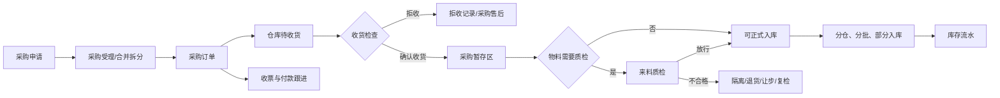

# Filatrix ERP Web 采购模块设计基线

> 当前版本：2026-07-30  
> 范围：仅采购订单（库存物料）；资产采购与资产台账已退出当前原型。

## 1. 设计目标

采购模块服务于 3D 打印耗材企业的原料、色母、助剂、包材和备件等库存物料采购。采购负责内部需求、供应商承诺和商务跟进，不替代仓库收货、质检判定或库存入账。

- 采购申请回答“为什么买、买什么、何时需要”。
- 采购订单回答“向谁买、买多少、按什么价格与交付条件买”。
- 仓库负责登记实际到货、拒收、暂存和正式入库。
- 质检负责需要检验物料的来料判定、放行、隔离、复检与退货建议。
- 收票和付款只作为采购人员维护的轻量商务跟进记录，不构成会计凭证。
- 设备基础资料是生产资源主数据，不从采购订单建档，也不保存采购来源或资产价值。

## 2. 主流程

## 3. 单据与责任边界

### 3.1 采购申请

- 由需求部门提交，可包含多条物料和需求数量。
- 物料必须来自可采购的物料基础资料。
- 质检方式从物料属性带入并冻结为行快照，申请人不能随意覆盖。
- 一张申请可被多张订单分批承接，多张申请也可合并成一张订单；承接关系必须保存来源申请、来源行和承接数量。

### 3.2 采购订单

- 仅支持库存物料采购，页面统一称“采购订单”，类型不再由用户选择。
- 保存供应商快照、物料行、数量、逐行价税、预计到货、交付方式、付款方式、收货联系信息、补充条款和附件。
- 草稿保存只保留录入内容；确认后锁定采购承诺并自动生成仓库待收货任务。
- 变更已确认订单必须通过受控变更，不能用普通保存覆盖下游已发生事实。
- 支持分批到货、少收、合理超收和关闭剩余待收数量；关闭余量必须记录原因。

### 3.3 仓库收货

- 仓库只处理待收货任务，不跳到采购、质检或售后页面替其他角色执行。
- 实际收货数量可以低于订单剩余量；允许超收时应受系统容差或明确确认控制，并保留差异事实。
- 仓库可整单或逐行拒收，记录数量、原因、时间、责任人和证据；拒收结果回写采购，采购决定补发、退货、折让或关闭余量。
- 确认收货后物料进入唯一采购暂存区；库位从仓库基础资料候选中选择，单一候选自动带入。

### 3.4 质检与正式入库

- 免检或不适用物料在收货后直接形成可入库数量。
- 需检物料只有质检放行数量可入库；待检和不合格数量不得计入可用库存。
- 正式入库允许部分数量、分仓和分库位执行。
- 只有启用批次管理的物料在正式入库时自动生成批次号，用户不能手填批次号。
- 入库、撤销和冲销均写入库存流水，禁止直接改库存余额。

### 3.5 采购售后

- 来源必须是采购订单及其实际收货/质检事实。
- 异常可来自仓库拒收、短溢收、错料、包装运输、交付延期或质检不合格。
- 采购登记供应商处理方案；仓库和质检只回写自己执行的退货、补收、复检或放行结果。
- 售后关闭必须有明确结果和数量闭环，不能只修改主状态。

### 3.6 收票与付款跟进

- 每条记录只需要金额、业务日期和可选备注。
- 可新增和删除人工登记；删除后累计金额与进度立即重算。
- 不强制编号、附件、银行账户或会计科目。
- 不生成应付、凭证、核销或资金流水，不向仓库和质检暴露跨模块执行动作。

## 4. 状态与进度

采购订单主状态只表达 `草稿 / 已确认 / 已关闭 / 已作废`。以下维度独立派生：

- 到货：未到货、部分到货、已到货、余量已关闭。
- 质检：免检、待检、部分放行、已放行、存在不合格。
- 入库：未入库、部分入库、已入库。
- 收票：未收票、部分收票、已收票、无需收票。
- 付款：未付款、部分付款、已付款、无需付款。
- 异常：无异常、拒收、短溢收、质检异常、退货/补发处理中。

列表和跟进页必须使用统一状态组件与色彩语义，但文案按采购业务表达，不借用销售、仓库或质检的动作名称。

## 5. 页面合同

- 菜单固定为采购申请、采购订单、采购售后和采购价格记录，不提供资产采购入口。
- 列表骨架与销售订单等订单型页面一致：主信息区 + 五维采购跟进区；状态徽标、进度条、空态、筛选和响应式卡片遵循全系统组件规范。
- 详情页展示冻结事实和关联记录；跟进页突出到货、质检、入库、收票、付款与异常。
- 采购页不提供仓库确认、质检判定、库存入账等跨角色按钮，只显示结果和进入本模块可执行动作。
- 采购订单可保留对外 PDF；系统不再存在资产采购 PDF、页面或接口。

## 6. 数据与迁移约束

- 页面与用户提示统一使用“采购订单”；为兼容现有原型数据，新建采购申请和订单的内部值仍为 `purchaseType = 物料采购`，前端不提供采购类型选择。
- 旧 `资产采购 / 设备资产采购` 测试单据及其流转、专用到货验收接口、直接收票分支和设备来源字段在迁移时删除。
- `EquipmentRecord.sourcePurchase`、资产金额、资产验收和登记状态不进入正式数据库模型。
- 正式数据库必须为单据号、行号、来源行、承接数量、幂等键、版本号和库存事件建立唯一约束与事务边界。

## 7. 验收基线

- 新建和编辑页不能出现采购类型、资产名称、资产用途、预算、资产验收或资产建档字段。
- `/purchase/asset-purchases` 及其详情、跟进、PDF、到货和验收接口不可访问。
- 采购订单确认能生成仓库待收货任务，仓库收货、质检、部分入库、拒收和关闭余量可以完整跑通。
- 设备页仍可独立维护生产设备，但没有来源采购字段或采购跳转。
- 构建、采购烟测、设备烟测、商务跟进烟测与浏览器回归必须通过。
