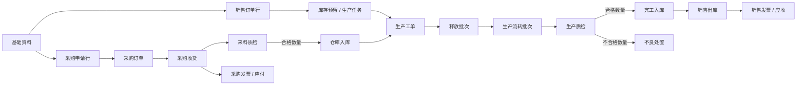

# Filatrix ERP Web 七模块业务一致性审计

> **历史审计记录（2026-09-16 标记）：**本文包含已经退出的独立财务模块，只保留阶段验收证据，不得据此恢复旧范围或覆盖当前业务合同。

> 审计日期：2026-07-18。范围：基础资料、销售、采购、仓库、财务、生产、质检。规则优先级以 `erp-web-prototype-blueprint.md` 和 `erp-web-business-fact-model.md` 为最高。

## 1. 本轮结论

此前五个模块并非只改了视觉，已经完成基础单位、公司主体、来源单据、状态拆分、库存数量、开票收付款等业务口径的第一轮收敛；但复核深度不一致，生产和质检也尚未真正纳入同一条业务链。本轮不再以“页面是否好看”为主，而是按以下三层统一检查：

1. 单据链是否能从来源对象和来源行追到下游；
2. 状态、数量与放行门禁是否可信；
3. 页面是否让使用者看懂当前事实、阻断原因和下一步。

七模块共同执行四条底线：

- 主状态只表达单据生命周期，交付、质量、库存、开票、收付款和异常分别表达；
- 下游单据必须保存来源单据、来源行和本次承接数量；
- 业务数量只使用物料基础单位，不维护销售/采购单位折合；
- “质检放行”不等于“仓库入库”，“生产报工”不等于“合格产出”。

## 2. 七模块审计矩阵

| 模块 | 已形成的正确基础 | 本轮发现的主要风险 | 本轮处理 |
| --- | --- | --- | --- |
| 基础资料 | 3D 打印耗材物料、基础单位、公司/仓库/供应商资料已统一 | 规则字段不应重新扩展为销售/采购单位换算 | 继续坚持单一基础单位，生产配方只记录实际耗用单位 |
| 销售 | 订单生命周期与生产、交付、开票、收款进度已拆开 | 销售行指向的生产任务编号与生产模块演示数据不一致 | 将 PETG 订单 `SO-20260715-022/L1` 与生产任务 `PT2-260715-006` 对齐 |
| 采购 | 请购、采购订单、收货、来料质检、入库、应付链已分层 | 生产补料仍指向旧的静态请购单，无法对应当前采购场景 | 改为引用 `PR-20260716-003` 的珍珠白色母明细 |
| 仓库 | 可用、预留、质检冻结、在途数量已分别显示 | 容易把来料合格或生产合格直接理解为库存增加 | 保持仓库过账为唯一库存生效动作，质量工作台单列“库存冻结” |
| 财务 | 发票生命周期与结算状态、来源行和核销数量已拆开 | 跨模块复核未发现新的高风险门禁问题 | 保持按来源订单行/收货行控制开票，收付款只改变结算事实 |
| 生产 | 已有任务、工单、释放批次、流转批次、异常和工作台 | 来源错配、报工良品重复计数、缺料被错误描述为不能建工单、工作台混入非待办 | 修正来源链和数量守恒；缺料只阻断释放/开工；工作台只显示有未建单缺口与真实关注批次 |
| 质检 | 来料、生产、巡检、标准和不良记录已分开 | 报工检混入巡检记录、不同单位直接相加、来源触发任务仍允许随意新建、缺少统一质量待办 | 校正记录类型，按单位分别汇总；来料/生产质检改为来源触发；新增质量工作台 |

## 3. 跨模块主流程

## 4. 已落地的关键业务修正

### 4.1 销售到生产

- `SO-20260715-022/L1` 需求 300 卷 PETG 透明耗材；
- 120 卷由库存预留承接；
- 180 卷由 `PT2-260715-006` 承接；
- 工单保存销售订单和来源行，不再让 PLA 哑光黑任务错误引用该销售订单。

### 4.2 生产到采购

- 珍珠白安全库存补货任务允许先建立计划工单；
- 珍珠白色母缺口进入备料申请；
- 备料申请引用 `PR-20260716-003`，到料并完成来料质检后才允许释放和开工；
- 缺料不阻止计划员建立工单，避免计划信息被隐藏。

### 4.3 报工、质量与完工数量

- 报工数量表示本次报告的总产出；
- 合格数量使用 `qualifiedQty`，缺失时按 `reportedQty - defectQty` 推导；
- A1 批次报工 70 卷、不良 2 卷，合格为 68 卷；
- A2 批次报工 40 卷、不良 1 卷，合格为 39 卷；
- 工单合格完成量为 107 卷，不再错误显示 110 卷；
- 报工全检部分合格时，只要存在不合格数量，就停在质量异常/处置门，不直接进入包装。

### 4.4 质量任务边界

- 来料质检由采购收货触发，生产质检由开机、报工或包装入库节点触发；
- 质量巡检和不良记录仍可人工发起；
- 原 `PQC-PATROL-*` 但标注为报工全检的两条记录已改成真实报工批次，巡检与报工检不再混用；
- 不良数量以 `袋、盘、箱、卷` 分组显示，不再把不同单位相加成一个无意义数值。

## 5. 页面与工作台决策

- 生产工作台“任务与建单”只显示仍有未承接生产数量的任务；
- “释放批次关注”只显示待释放、缺料、待复判/拒收或执行异常，不再把所有有下一步文字的批次都列成异常；
- 生产操作权限全部指向当前生产工作台，删除已下线的现场执行和打包抽检旧路径；首检放行继续归质检权限；
- 新增质量工作台，集中显示来料待判定、生产待判定、复判/整改、未关闭不良和质检冻结；
- 质量工作台明确展示“结论 ≠ 处置、放行 ≠ 入库、按来源行守恒”，防止主状态再次承担多个含义。

## 6. 第二阶段落地结果（2026-07-18）

1. 生产工单、释放批次、流转批次、生产质检任务和生产异常已建立运行时黄金场景；接口成功时工作台、列表和详情只认运行时事实，静态数据仅在接口不可用时回退，不再按编号混合两套状态；
2. 重置演示数据时保留生产运行时黄金场景，不再把 `production` 清空；
3. 生产质检使用独立不合格处置事实 `PQD2` 承接让步审批和报废；返工不再作为“已经合格”的直接处置选项，而是建立 `PRW2` 返工任务和 `PRI2` 复检任务；
4. 检验结论保持原始事实，处置进度拆成未闭环、返工/复检中和尚未安排；活动返工任务占用对应不合格数量，避免同一数量被重复让步、报废或再次返工；
5. 完整业务流自动化回归已覆盖“报工 2 卷 → 1 卷合格、1 卷不合格 → 创建返工任务 → 完成返工 → 生成复检任务 → 复检合格 → 2 卷恢复包装与入库”，同时校验复检幂等。

## 7. 后续重点

1. 已将生产计划、释放、报工、质检合格、入库放行和仓库入库收敛为按销售来源行聚合的运行时数量链；销售、生产和仓库页面不再混用“完成量”；
2. 巡检整改和不良记录已迁为服务端运行时闭环对象；后续继续补责任时效提醒、复查失败升级和附件实体存储；
3. 补充生产任务拆分、合并、超产与尾差关闭规则，避免计划量变化只能依赖人工解释；
4. 正式数据库阶段以事务、版本锁和唯一约束替代单进程 JSON 的顺序写入保证。

### 7.1 已确认的后续执行队列（2026-07-18）

以下事项已确认保留，不因当前先分析配方、工序和工艺而关闭：

1. 已完成 `PQC2 → PRW2 → PRI2 → PQD2` 的“返工任务 → 返工执行 → 复检任务 → 复检结论”过程事实；复检前不增加合格数量；
2. 下一步补生产任务拆分、任务合并、允许超产范围、尾差关闭与计划变更的数量守恒规则；
3. 巡检整改、不良记录运行时闭环已完成版本、幂等、附件元数据和审计日志第一阶段；后续重点转为复查失败升级与正式附件对象。

该队列是后续实施顺序记录，不表示配方/工艺设计可以绕过版本快照、来源追溯或质量门禁。

## 8. 第三轮生产/质检细查结果（2026-07-18）

1. 修复生产列表异步运行事实不触发重算的问题。任务 `PT2-260701-003` 现在稳定显示 1 个工单、释放 8 卷、待建 232 卷；工单 `MO2-260630-004` 稳定显示 1 个流转批次、报工 8 卷、合格 7 卷；批次 `EC2-260630-006` 同时读取 `RB2` 的已领料、返工中和待放行状态。
2. 物料摘要改为“1 项短缺 · 2 项可齐套”等明确口径，并把任务关联工单的本单分配计入齐套判断。
3. 工艺温区已按现场顺序排列，配方/工艺/系统动作右侧摘要去掉与主体重复的编号、名称、版本和状态。
4. 质量巡检整改链补齐保存、附件和提交入口；`QPATROL-20260701-001` 变更页已显示“保存 + 提交整改”，不再只读阻断。
5. 不良主状态改为待处理、处置中、待验证、已关闭；返绕和供应商确认继续作为独立处置方式。`NCR-20260616-002` 列表显示处置中，变更页下一步为提交验证。
6. 浏览器回归已核对生产任务、生产工单、生产批次、生产工艺、巡检变更和不良列表；59 项 UI 一致性审计与正式构建通过。

仍未完成的边界：生产任务拆分、合并、允许超产、尾差关闭和计划变更仍按既定队列继续；巡检复查失败自动升级、正式附件对象和数据库并发约束留待后续。

## 9. 第四轮生产/质检蓝图复核（2026-07-18）

1. 生产工作台在运行时工单加载完成后重新生成产线、队列、在制和报工读模型，不再只替换工单而保留旧产线快照；列表和工作台共同读取 `MO2 / RB2 / EC2`。
2. 工单/批次下钻工作台时，异步加载完成后按 URL 中的工单和释放批次再次定位。代表场景可从 `MO2-260630-004 / RB2-260630-006` 直接选中复绕 R1 线。
3. 异常停机不再把当前工序画成开机确认。`EC2-260630-006` 保持在成品报工检节点，节点显示需处理；解除异常后恢复原节点。
4. 工作台待质检指标按批次去重，代表数据由重复统计的 5 个修正为真实的 3 个。
5. 巡检与不良删除浏览器本地质量账本，改用服务端新建、保存、阶段推进命令；修订号冲突、幂等重试、附件元数据和流转日志已进入自动化回归。
6. 浏览器实际提交 `QPATROL-20260701-001` 后，详情、巡检列表和质量工作台同时显示待复查；质量工作台不再重复 `EC2` 编号。
7. 来料数量统一基础单位，`IQC2-260701-001` 显示 `125 kg`，`5 袋`仅表示抽样；冻结摘要在运行时空壳记录存在时仍保留完整黄金场景。
8. 端到端烟测已覆盖巡检 `待巡检 → 待整改 → 待复查 → 已关闭` 和不良 `待处理 → 处置中 → 待验证 → 已关闭`，并验证保存修订、附件元数据和流转日志。

## 10. 第五轮生产/质检数量链复核（2026-07-18）

1. 生产工单列表、详情提示和右侧摘要改为显示流转批次分布；`MO2-260701-001` 当前明确为待质检 2 个、待包装 1 个，不再只显示“待抽检”。
2. 工单和生产批次详情补齐报工、待判定、合格、不良、入库检放行、待仓库入库、已入库和计划未入库数量，主状态不再承担数量解释。
3. 修复 `EC2-260701-001` 的提前入库提示：剩余 38 卷尚未包装和入库抽检，因此回到待包装节点；已入库仍为已正式过账的 30 卷。
4. 来料质检列表统一采购收货和转待入库口径；历史合格与免检记录不再显示“放行入库/直接入库”。
5. 质量工作台把不良记录数和检验待处置分开，并明确来料冻结卡统计的是批次而非库存数量。

后续队列保持：生产任务拆分/合并、超产审批、尾差结案和计划变更数量守恒仍需独立命令与服务端校验，不能仅增加前端按钮。

## 11. 第六轮七模块横向事实复核（2026-07-18）

1. 逐项抽查七模块全部菜单列表，并回查物料、销售订单、采购订单、采购收货、销售发票、生产工单和来料质检代表详情；本轮重点从视觉统一转为来源事实、数量口径和跨模块下钻一致性。
2. 来料质检列表与详情增加统一读模型，补齐原先只存在判定/收货事实、字段较少而被列表漏掉的 `IQ-*` 任务；质量工作台现在能看到部分判定任务，并明确“继续判定冻结数量 + 处置不合格数量”。
3. 采购发票改为只承认采购收货的仓库正式入库数量。质检已放行但仓库尚未过账的 650 kg PETG 不再被误判为可确认发票数量。
4. 清理与当前业务场景冲突的 PETG 旧期初可用库存。生产工单 `MO2-260715-006` 改为“待释放”，阻断原因显示“待仓库入库”，不再同时出现可释放与缺料、待领料与未释放等矛盾口径。
5. 仓库生产领料补齐四张已被生产流转批次引用的历史 `WM2` 单据及库存流水；配方领料明细包含原料、色母和空盘，不再只有部分材料或孤立关联编号。
6. 已关闭且签收的销售订单补齐对应销售出库单，交付进度从错误的“待出库”恢复为“已签收”；采购订单关联单据统一命名为“采购收货”。
7. 浏览器已回查质量工作台、生产工单列表、仓库生产领料、采购订单、销售订单、采购发票和库存代表场景；后续门禁继续由类型、UI 审计、前端烟测、流程烟测和正式构建验证。
8. 可见页面回归发现“当前不可释放”工单仍显示“释放”主按钮；现已按阻断事实改为“查看待入库/查看物料”，并直接进入对应仓库页面，避免视觉动作绕过物料门禁。
